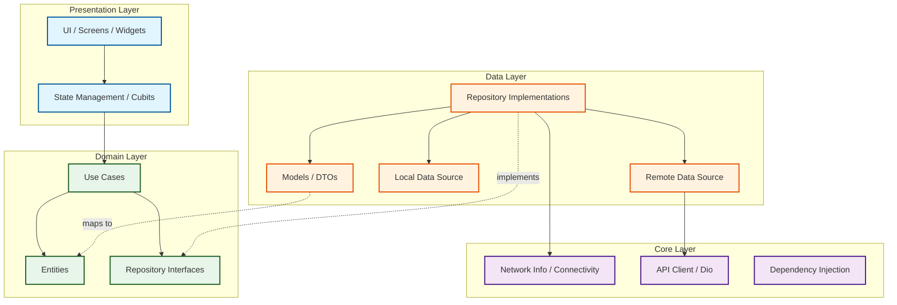

# Flutter Starter Template

## 1. Architecture diagram



## 2. Setup

Run these commands in this exact order:

```bash
flutter pub get
dart run build_runner build --delete-conflicting-outputs
flutter run
```

## 3. How to add a new feature

Follow this 6-step checklist to cleanly implement a new feature:

1. **Step 1:** Create a new folder under `lib/features/your_feature/` (e.g., `lib/features/profile/`).
2. **Step 2:** Define the core entity in `domain/entities/` (Plain Dart class, no JSON serialization).
3. **Step 3:** Define the abstract repository interface in `domain/repositories/`.
4. **Step 4:** Write the use-case(s) in `domain/usecases/` that call the repository.
5. **Step 5:** Implement the repository in `data/repositories/`.
   - Inject `NetworkInfo` via constructor.
   - Always check `isConnected` *before* making remote calls.
6. **Step 6:** Build the state management (Cubit) and UI (Screen) in `presentation/`.

## 4. Common errors and fixes

*   **`build_runner` conflicts:**
    *   **Fix:** Run `dart run build_runner build --delete-conflicting-outputs`
*   **`get_it` not registered / `No GetIt implementation found`:**
    *   **Fix:** Did you call `await configureDependencies();` before `runApp()` in `main.dart`?
*   **GoRouter redirect loop:**
    *   **Fix:** Check your redirect logic. Ensure that the `AuthCubit` emits `AuthAuthenticated` before navigating, and that you aren't unconditionally redirecting to the same page.
*   **`flutter_secure_storage` crashing on Android:**
    *   **Fix:** Ensure you have added `minSdkVersion 18` (or higher) in your `android/app/build.gradle`.
*   **`connectivity_plus` returns connected but API still fails:**
    *   **Fix:** `connectivity_plus` checks the active network interface (e.g., Wi-Fi turned on), not actual pingable internet access (e.g., behind a captive portal). Always handle `DioException` gracefully too.

## 5. Logging guide

We use a custom wrapper in `core/utils/logger.dart` instead of standard `print()`.

*   `logInfo()` → Normal app events ("User logged in", "Data fetched").
*   `logWarning()` → Something unexpected happened but the app didn't crash.
*   `logError()` → Caught exceptions (always pass the error/stacktrace object).
*   `logDebug()` → Temporary output for local development. Remove before submitting a PR.
*   **To upgrade to Crashlytics:** Edit *only* `core/utils/logger.dart`. The rest of the app will automatically log to the new service.

## 6. When to consider Melos monorepo

If you join a large team or build times exceed 2 minutes, read: [melos.invertase.io](https://melos.invertase.io/)
